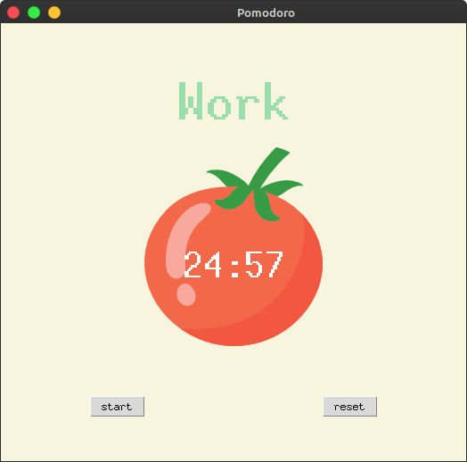
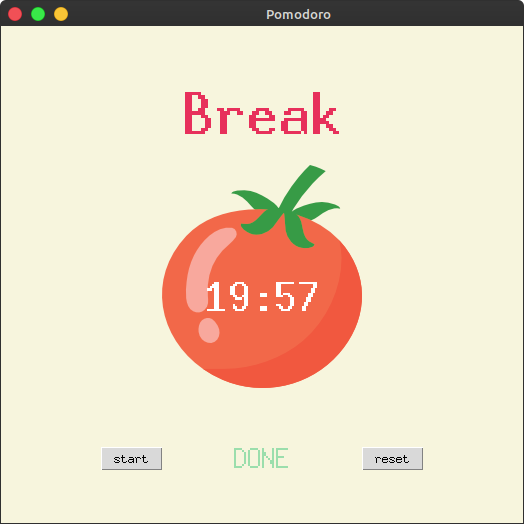

# pomodoro-app

A simple Pomodoro app that have three functionalities: Work sessions of 25 minutes, short break session of 5 minutes and long break sessions of 20 minutes. The app contains a pretty simple and minimalist Graphical User Interfac with a label containing the current session, a .png of a tomatoe, a timer in the middle of the tomotoe .png and two buttons to start the session and to reset it. The project was made if Python, TKinter and other Python standard libraries.

